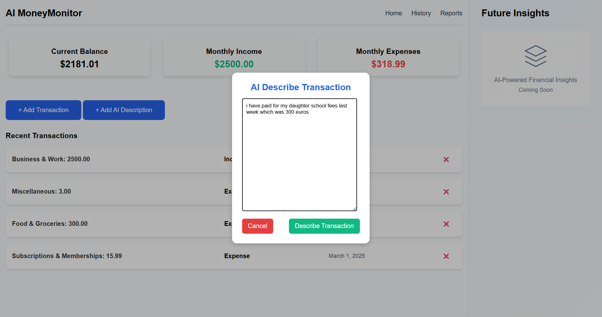
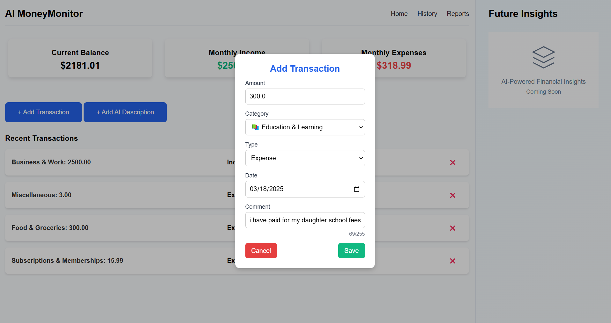
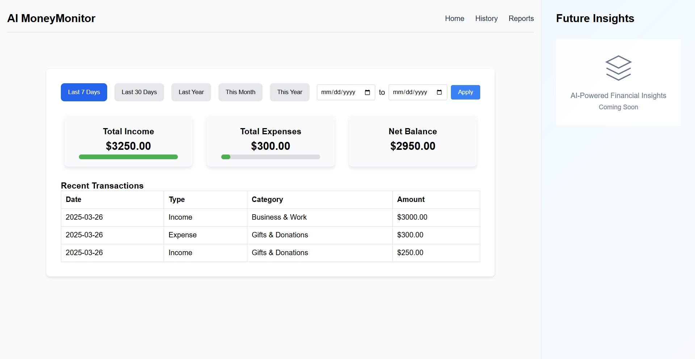

# Finance AI Tracker

Welcome to the **Finance AI Tracker** project! This Django web application helps users track their income and expenses, visualize financial data, and manage transactions.

## Description

This project helps individuals manage their finances by tracking both income and expenses. It allows users to view recent transactions, categorize their expenses, and see monthly summaries. Additionally, AI-powered descriptions can be added to transactions to provide insights.




## Features

- Track income and expenses
- View monthly summaries of income and expenses
- Filter transactions by date range (e.g., last 7 days, last month)
- Add AI-powered descriptions to transactions
- View detailed reports of your financial data



### Steps to install

1. Clone this repository:

   ```bash
    git clone https://github.com/dxdelvin/financeAITracker.git
   
    cd financeAITracker

    python manage.py migrate
    
    python manage.py createsuperuser
   
    python manage.py runserver


Contributing
1. Feel free to fork the project and contribute! Please follow these steps if you would like to contribute:

2. Fork the repository

3. Create a new branch (git checkout -b feature-branch)

4. Make your changes

5. Commit your changes (git commit -am 'Add new feature')

6. Push to your branch (git push origin feature-branch)

7. Open a pull request